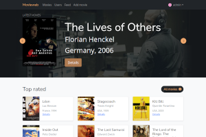
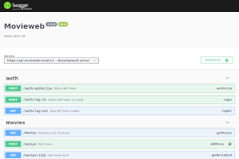
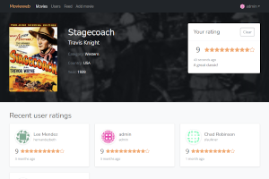
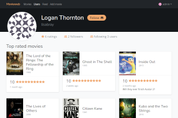

<h1 align="center">
    
    <br />
    Movieweb
</h1>
<p align="center">
    Movieweb is an IMDB-like website utilizing microservices architecture.
</p>
<p align="center">
    <a href="readme/screen-homepage.png"></a>
    <a href="readme/screen-api.png"></a>
    <a href="readme/screen-movie.png"></a>
    <a href="readme/screen-user.png"></a>
</p>

## Architecture

There are five types of services inside a network built by `docker-compose`:

* `webapp`: serves precompiled React SPA
* `public-api`: API gateway (Node.js, express)
* `load-balancer`: `nginx` edge router, proxies traffic to webapp and the API endpoint
* `movies`: handles movie information (FastAPI)
* `users`: handles user information and authentication (FastAPI)
* `reviews`: handles reviews (FastAPI)
* `relations`: handles followers (FastAPI)
* `redis`: caching storage for `public-api`

Endpoints communicate using REST API. All endpoints provide OpenAPI 3 schemes. API endpoints and the webapp use clients generated from the spec.

Authentication uses JWT tokens signed by `users` service. `public-api` saves `httpOnly` cookies to store token with the user.

#### Public endpoints

* `https://movieweb.local/`: website
* `https://api.movieweb.local/`: API entry
* `https://api.movieweb.local/docs`: Swagger docs
* `https://api.movieweb.local/openapi.json`: API schema

## Development

### First time setup

1. Redirect local domains to localhost.
    ```
    echo -e "127.0.0.1\tmovieweb.local\n" >> /etc/hosts
    echo -e "127.0.0.1\tapi.movieweb.local\n" >> /etc/hosts
    ```
1. Generate self-signed SSL keys.
    ```
    ./scripts/regenerate-dev-keys.sh
    ```
1. Build services.
    ```
    cd services && docker-compose build
    ```

Browser will display a security warning later, because it doesn't know root CA you just created. You can safely add an exception. Still seeing errors? Visit `https://api.movieweb.local/docs` and whitelist `api` subdomain too.

